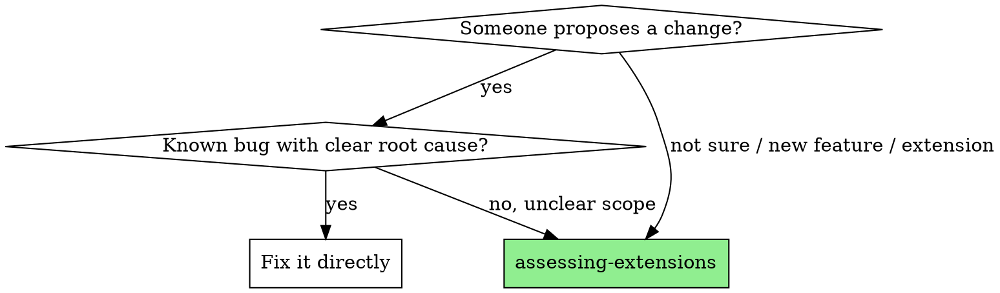

# Assessing Extensions

Diagnose the scope and impact of a proposed extension before planning it.

**Core principle:** Assess first, plan second. Produce a written artifact that captures exploration findings, tier classification, and relevant decisions — so planning works from evidence, not guesswork.

**Announce:** "Using assessing-extensions to evaluate scope and impact."

## When to Use



## The Process

### Stage 1: Understand the Request

Ask the user (one question at a time):
- **What:** The proposed change in one sentence
- **Why:** What triggered this (feedback, metric, pain point, deferred decision)
- **Initial gut:** How big does the user think this is?

### Stage 2: Explore Impact

Dispatch exploration subagents as needed:

| Subagent | Task | When to Dispatch |
|---|---|---|
| **Component scan** | Which modules/dirs does this touch? How many files? | Always |
| **Decision search** | Grep spec/decision log for related D# decisions | Always for Tier 2+ suspects |
| **Dependency trace** | What must exist first? What does this unblock? | When change has prerequisites |
| **Pattern match** | Has a similar extension been done before? | When change resembles past work |

See `./exploration-prompts.md` for subagent prompt templates.

### Stage 3: Classify

**Tier** (planning rigor):

| Tier | Signal |
|---|---|
| **1: Configuration** | Uses existing extension point, 1-2 files, no new decisions |
| **2: Feature-scoped** | New capability within existing architecture, 3-10 files, 1-4 new decisions |
| **3: Architectural** | Changes system shape, 10+ files or 3+ components, affects existing decisions |

**Modifiers** (orthogonal to tier):

| Modifier | Signal |
|---|---|
| `breaking` | Changes public API, DB schema, or external contracts |
| `multi-repo` | Affects more than one repository |
| `spike-required` | Feasibility uncertain, needs research first |
| `deprecation` | Removes or sunsets existing capability |
| `migration` | Requires data migration or rollout coordination |

### Stage 4: Write Assessment

Write to `docs/assessments/YYYY-MM-DD-{name}.md` using the output template below.

## Output Template

```markdown
# Assessment: {Extension Name}

**Date:** YYYY-MM-DD
**Requested by:** {who asked}
**Trigger:** {what prompted this}

## What
{One paragraph: what is the proposed change and why}

## Classification

**Tier:** {1 | 2 | 3}
**Rationale:** {Why this tier — based on exploration findings}

**Modifiers:**
- [ ] `breaking` — Changes public API, DB schema, or external contracts
- [ ] `multi-repo` — Affects more than one repository
- [ ] `spike-required` — Feasibility uncertain, needs research first
- [ ] `deprecation` — Removes or sunsets existing capability
- [ ] `migration` — Requires data migration or rollout coordination

## Impact Analysis

### Components Affected
| Component | Impact | Files (est.) |
|---|---|---|
| {component} | {what changes} | {count} |

### Relevant Decisions
| Decision | Summary | Relationship |
|---|---|---|
| D{N} | {one-line} | {constrains | enables | superseded by this change} |

### Dependencies
- **Requires first:** {what must exist}
- **Unblocks:** {what this enables}

## Risk Factors
- {risk 1}
- {risk 2}

## Recommendation
{Tier 1: "Go ahead, no plan needed" | Tier 2-3: "Proceed to planning-extensions" | spike-required: "Run spike first, then re-assess"}
```

## After Assessment

| Classification | Next Step |
|---|---|
| Tier 1 | Tell user to proceed directly. No planning skill needed. |
| Tier 2-3 | **REQUIRED SUB-SKILL:** Use `planning-extensions` |
| Any + `spike-required` | Run the spike first, then re-run this assessment |

## Common Mistakes

- **Skipping exploration** — Don't classify from gut feel. Dispatch subagents.
- **Overclassifying** — A 3-file change isn't Tier 3 just because it's in a critical path. Tier is about planning rigor needed, not importance.
- **Missing modifiers** — Always check for `breaking`. A small change that alters the API contract needs a migration plan regardless of tier.
- **Not writing the artifact** — The assessment must be written to `docs/assessments/`, not just discussed in conversation. Written artifacts survive context boundaries.
