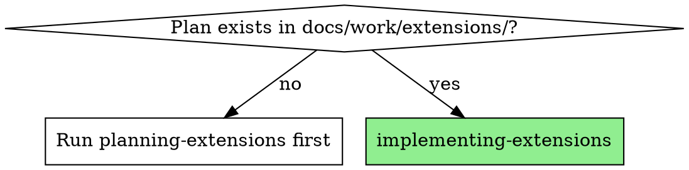

# Implementing Extensions

Execute an extension plan with per-task verification, decisions tracking, and test suite validation. Supports resuming across sessions or after context compacting.

**Core principle:** The plan is the spec. The plan's per-task Verification criteria serve double duty: they prove a task was done correctly, AND they detect which tasks are already complete on resume.

**Announce:** "Using implementing-extensions to execute the extension plan."

## When to Use



**Prerequisite:** A plan document must exist at `docs/work/extensions/ext-{NNN}-{name}/plan.md`. Do NOT implement without a plan.

## The Process

### Step 1: Load and Detect Progress

1. Read the plan from `docs/work/extensions/ext-{NNN}-{name}/plan.md`
2. Verify the assessment exists at `docs/work/extensions/ext-{NNN}-{name}/assessment.md`
3. List all T-numbered tasks, new D-numbered decisions, and superseded decisions
4. **Resume detection:** For each task, run its Verification criterion against the current codebase:
   - Passes → task already complete, skip
   - Fails → task needs implementation
5. Report progress: "N of M tasks already complete. Resuming from T{X}."
6. Create tracked tasks (TaskCreate) only for incomplete tasks

This makes the skill **idempotent** — safe to invoke after context compacting, in a new session, or as a retry.

### Step 2: Execute Tasks

For each **incomplete** task in T-number order:

1. **Start:** Mark task as `in_progress` (TaskUpdate)
2. **Implement:** Follow the task's Action exactly — files, changes, specific instructions
3. **Verify:** Run the task's Verification criterion. Evidence required — no assumptions.
4. **Complete:** Mark task as `completed` (TaskUpdate) only after verification passes

**Parallelism:** Tasks with no dependency relationship may be dispatched to parallel subagents. Tasks with dependencies must be sequential.

**Blockers:** If a task fails verification or hits an unexpected issue, STOP. Report the issue to the user before continuing.

### Step 3: Overall Verification

After all tasks are complete, run the plan's Verification checklist line by line:

1. Read each `- [ ]` item from the plan's Verification section
2. Run the specific check (grep, test command, file existence, etc.)
3. Report pass/fail for each item with evidence

### Step 4: Test Suite

Run the project's test suite to catch regressions:

```
php artisan test --parallel
npm test
```

Both must pass. If tests fail, fix before proceeding.

### Step 5: Completion

1. Update `docs/reference/spec/decisions-index.md` — this should already be done as a tracked task, but verify:
   - New D-numbers are present with correct summaries and source `ext-{NNN}`
   - Superseded decisions are marked with strikethrough and `Superseded` status
2. Report final status to user with verification evidence
3. Offer commit via `/commit`

## Common Mistakes

- **Skipping resume detection** — Always run Step 1 verification checks, even if you think this is a fresh session. Context compacting is invisible.
- **Skipping per-task verification** — Every task has a Verification field. Run it. Don't assume it worked because the edit looked right.
- **Implementing out of order** — Tasks may have dependencies. Check before parallelizing.
- **Forgetting decisions index** — The decisions index update is a tracked task in the plan. Treat it like any other task, not an afterthought.
- **Declaring done without test suite** — Run `php artisan test --parallel` and `npm test` before claiming completion. This catches regressions the per-task checks miss.
- **Not reporting blockers** — If a task's verification fails, stop and report. Don't silently skip or work around it.
