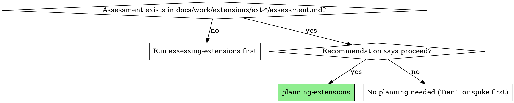

# Planning Extensions

Transform an extension assessment into an actionable, right-sized planning document.

**Core principle:** Right-sized planning. Tier 1 gets no document. Tier 2 gets a single-page decision doc. Tier 3 gets a full design addendum. Modifiers add sections — they extend, never replace.

**Announce:** "Using planning-extensions to create the implementation plan."

## When to Use

**Prerequisite:** An assessment document must exist. Do NOT plan without assessing first.

## The Process

1. **Read the assessment** from `docs/work/extensions/ext-{NNN}-{name}/assessment.md`
2. **Determine the tier** from the Classification section
3. **Check modifiers** from the modifier checkboxes
4. **Select base template** — see `./tier2-template.md` or `./tier3-template.md`
5. **Add modifier sections** — see `./modifier-sections.md` for each checked modifier
6. **Fill the template** using data from the assessment's Impact Analysis
7. **Write the atomic task list** — flat, T-numbered, with dependencies and verification
8. **Assign new D-numbers** — continue from the highest existing decision number
9. **Save to** `docs/work/extensions/ext-{NNN}-{name}/plan.md` (same folder as the assessment)
10. **Offer execution handoff**

## Template Selection

| Tier | Template | Output Size |
|---|---|---|
| 1 | None — assessment already said "go ahead" | This skill should not fire |
| 2 | `./tier2-template.md` — single-page decision doc | 1-2 pages |
| 3 | `./tier3-template.md` — full design addendum (includes all of Tier 2 plus additional sections) | 3-5 pages |

## Numbering Conventions

- **Decisions:** Continue D-numbering from the highest existing number. Check `docs/reference/spec/decisions-index.md` and any existing `docs/work/extensions/` docs.
- **Tasks:** Continue T-numbering from the highest existing number. Check `progress.md`.
- **Extensions:** Number sequentially: `ext-001`, `ext-002`, etc. Check existing `docs/work/extensions/` directory.

## Execution Handoff

After saving the plan, offer:

**"Plan saved to `docs/work/extensions/ext-{NNN}-{name}/plan.md`. Ready to implement?"**

**REQUIRED NEXT SKILL:** Use `implementing-extensions` to execute the plan.

## Common Mistakes

- **Planning without assessment** — Always check for the assessment document first. No assessment = run `assessing-extensions`.
- **Wrong template for tier** — Tier 2 does NOT need component design sections or rollback plans. Don't over-plan.
- **Forgetting modifiers** — A Tier 2 + `breaking` extension needs the Migration Plan section even though it's "just" Tier 2.
- **Vague tasks** — Every task must name specific files, specific actions, and specific verification criteria. Follow the atomic task list convention.
- **Guessing D-numbers** — Always check the actual highest D-number before assigning new ones.
