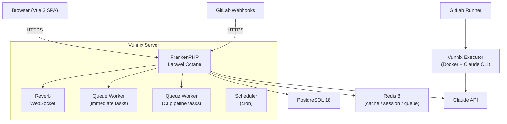

# Vunnix

AI-powered development platform for **self-hosted GitLab Free** — conversational AI chat + event-driven code review orchestrator.

Vunnix gives every role on a software team a natural-language interface to Claude AI, while keeping **GitLab as the single source of truth**. No GitLab Premium or Duo Enterprise required.

## What It Does

- **Product Managers** chat to iterate on feature requirements → GitLab Issues / Wiki PRDs
- **Designers** chat to request UI adjustments → GitLab MRs with visual fixes
- **Engineers** use `@ai` commands on MRs and Issues → automated code review and assistance
- **Managers** view the Vunnix dashboard → quality trends, cost tracking, adoption metrics

All artifacts (Issues, MRs, comments) stay in GitLab.

## Architecture



## Getting Started

### Prerequisites

- [Docker Desktop](https://www.docker.com/products/docker-desktop/) (4 GB RAM minimum)
- A GitLab instance (gitlab.com or self-hosted)
- [Anthropic API key](https://console.anthropic.com/)
- A dedicated GitLab bot account with Personal Access Token

### Quick Start

```bash
# Clone and start services
git clone https://github.com/bepsvpt/vunnix.git
cd vunnix
docker compose up -d --build

# First-time setup (install deps, create .env, generate key, build frontend)
docker compose exec app composer setup

# Edit .env — set GitLab OAuth, Anthropic API key, tunnel URL
# Then run database migrations
docker compose exec app php artisan migrate
```

A **reverse proxy tunnel** (cloudflared or ngrok) is needed for GitLab webhooks to reach your machine. See [`docs/local-dev-setup.md`](docs/local-dev-setup.md) for the complete walkthrough.

### Register a GitLab Project

```bash
docker compose exec app php artisan vunnix:setup <GROUP/PROJECT>
```

See [`docs/project-setup.md`](docs/project-setup.md) for CI template integration.

## Development

```bash
# Start dev environment (server + queue + logs + Vite, all concurrent)
composer dev

# Run PHP tests (--parallel required, 1,600+ tests OOM otherwise)
php artisan test --parallel

# Run Vue/JS tests
npm test

# Code style (PSR-12)
composer format
```

> **Note:** FrankenPHP and queue workers cache code in memory. After code changes, run `docker compose down && docker compose up -d` — a simple `restart` is not sufficient.

## Deployment

Pre-built images are published to GitHub Container Registry. No build tools needed on the server.

```bash
# Download production compose file and env template from GitHub Releases
# Configure .env with secure passwords, API keys, and domain
# Then:
docker compose -f docker-compose.production.yml up -d
docker compose exec app php artisan key:generate
docker compose exec app php artisan migrate --seed
```

**Requirements:** Linux with 2+ CPU, 4+ GB RAM, Docker Engine 24.0+.

See [`docs/deployment.md`](docs/deployment.md) for backup/restore, upgrades, and production configuration.

## Testing

```bash
php artisan test --parallel   # PHP (Pest) — 1,600+ tests
npm test                      # Vue (Vitest)
composer format               # Code style
```

Local tests run against SQLite `:memory:` (fast, no services needed). CI tests run against real PostgreSQL 18 to match production. External APIs are faked via `Http::fake()` and AI SDK `HasFakes`.

## Documentation

| Document | Description |
|----------|-------------|
| [`docs/spec/vunnix-v1.md`](docs/spec/vunnix-v1.md) | Complete specification (155 decisions, 116 tasks) |
| [`docs/local-dev-setup.md`](docs/local-dev-setup.md) | Local development setup |
| [`docs/deployment.md`](docs/deployment.md) | Production deployment |
| [`docs/project-setup.md`](docs/project-setup.md) | Integrating GitLab projects |
